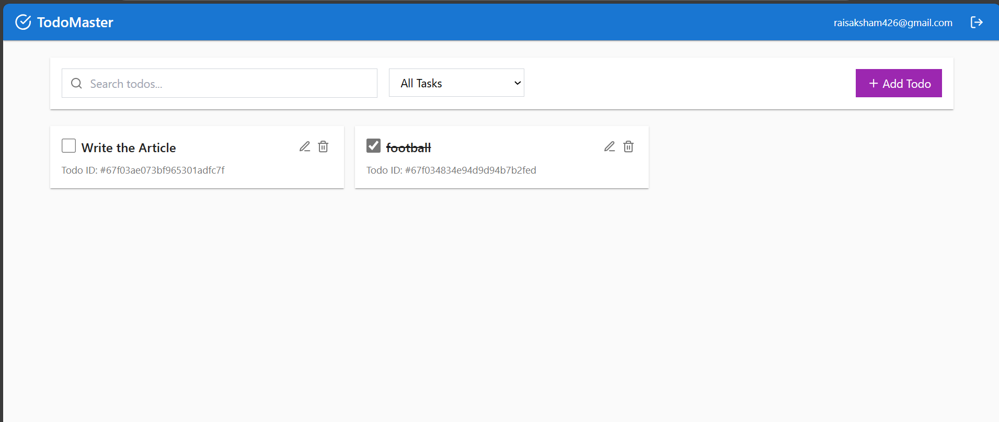

# React Redux TypeScript Todo Application

A modern, full-stack todo application built with React, Redux, TypeScript, and MongoDB. This application features user authentication, complete CRUD operations for todo items, and a responsive UI.



## 📋 Features

- **User Authentication**
  - Secure signup and login functionality
  - JWT-based authentication
  - Password encryption with bcrypt
  - Protected routes for authenticated users

- **Todo Management**
  - Create, read, update, and delete todos
  - Mark todos as complete/incomplete
  - Filter todos by status (all/completed/incomplete)
  - Search todos by title
  - Pagination for better performance with large lists

- **Modern UI**
  - Responsive design that works on mobile, tablet, and desktop
  - Clean, intuitive interface
  - Material Design inspired components
  - Smooth transitions and loading states

## 🏗️ Architecture

The application follows a modern full-stack architecture with clear separation of concerns:

### Frontend Architecture

```
client/
├── src/
│   ├── components/     # Reusable UI components
│   ├── hooks/          # Custom React hooks
│   ├── lib/            # Utility functions and API client
│   ├── pages/          # Page components
│   ├── store/          # Redux store, slices, and actions
│   └── types/          # TypeScript type definitions
```

### Backend Architecture

```
server/
├── controllers/        # Request handlers
├── db/                 # Database connection
├── middleware/         # Custom middleware
├── models/             # Mongoose data models
└── routes/             # API route definitions
```

### Data Flow

1. **Frontend to Backend**:
   - React components trigger Redux actions
   - Redux thunks make API calls to the backend
   - API responses update the Redux store
   - React components re-render with new data

2. **Backend to Database**:
   - Express routes receive API requests
   - Controllers process the requests
   - Mongoose models interact with MongoDB
   - Responses are sent back to the frontend

## 💻 Technical Implementation

### Frontend Technologies

- **React**: UI library for building the user interface
- **Redux**: State management with Redux Toolkit
- **TypeScript**: Static typing for improved developer experience
- **React Hook Form**: Form handling with validation
- **Axios**: HTTP client for API requests
- **TailwindCSS**: Utility-first CSS framework for styling

### Backend Technologies

- **Node.js**: JavaScript runtime for the server
- **Express**: Web framework for handling HTTP requests
- **MongoDB**: NoSQL database for data storage
- **Mongoose**: ODM for MongoDB
- **JWT**: JSON Web Tokens for authentication
- **Bcrypt**: Password hashing for security

### Authentication Flow

1. User submits signup/login form
2. Server validates credentials
3. If valid, server generates JWT token
4. Token is stored in client (Redux store)
5. Token is included in subsequent API requests
6. Protected routes/resources check token validity

### Todo Operations Flow

1. **Create Todo**:
   - User submits new todo form
   - Client sends POST request to `/api/todos`
   - Server creates todo in MongoDB
   - UI updates with new todo

2. **Read Todos**:
   - Client sends GET request to `/api/todos`
   - Server fetches todos for the authenticated user
   - UI displays todos with pagination

3. **Update Todo**:
   - User edits todo or toggles completion status
   - Client sends PUT request to `/api/todos/:id`
   - Server updates todo in MongoDB
   - UI updates with modified todo

4. **Delete Todo**:
   - User confirms todo deletion
   - Client sends DELETE request to `/api/todos/:id`
   - Server removes todo from MongoDB
   - UI removes todo from list

## 🚀 Getting Started

### Prerequisites

- Node.js 14.x or higher
- MongoDB database (local or Atlas)

### Installation

1. Clone the repository:
   ```bash
   git clone https://github.com/SakshamChouhan/todo-app.git
   cd todo-app
   ```

2. Install dependencies:
   ```bash
   npm install
   ```

3. Create a `.env` file in the root directory with your MongoDB connection string:
   ```
   MONGODB_URI=mongodb+srv://your-connection-string
   JWT_SECRET=your-secret-key
   ```

4. Start the development server:
   ```bash
   npm run dev
   ```

5. Open your browser and visit `http://localhost:5000`

## 🔒 Security Considerations

- Passwords are hashed using bcrypt before storage
- JWT tokens are used for stateless authentication
- Environment variables secure sensitive information
- MongoDB connection uses TLS encryption
- Input validation on both client and server

## 📱 Responsive Design

The application is designed to work across multiple device sizes:

- **Mobile**: Single column layout, optimized touch targets
- **Tablet**: Two column layout with additional features
- **Desktop**: Full-featured interface with optimized spacing

## 🧪 Testing

- Run unit tests:
  ```bash
  npm test
  ```

- Run end-to-end tests:
  ```bash
  npm run test:e2e
  ```

## 🛠️ Developer Workflow

### Development Environment Setup

1. **Clone the repository**
   ```bash
   git clone https://github.com/SakshamChouhan/todo-app.git
   cd todo-app

   ```

2. **Install dependencies**
   ```bash
   npm install
   ```

3. **Configure environment variables**
   Create a `.env` file in the project root with:
   ```
   MONGODB_URI=your_mongodb_connection_string
   JWT_SECRET=your_secret_key
   ```

4. **Start the development server**
   ```bash
   npm run dev
   ```
   This starts both the Express backend and the Vite frontend in development mode.

### Common Development Tasks

#### Backend Development

1. **Creating a new API endpoint**
   - Define the route in `server/routes/yourRoutes.ts`
   - Implement the controller method in `server/controllers/yourController.ts`
   - Create or update the model if needed in `server/models/yourModel.ts`
   - Test the endpoint with a tool like Postman or curl

#### Frontend Development

1. **Adding a new component**
   - Create the component file in `client/src/components/YourComponent.tsx`
   - Add Redux integration if needed
   - Add API integration if needed

2. **Creating a new Redux slice**
   - Create the slice file in `client/src/store/yourSlice.ts`
   - Add the slice to the store in `client/src/store/index.ts`

3. **Adding a new page**
   - Create the page component in `client/src/pages/YourPage.tsx`
   - Add the route to the router in `client/src/App.tsx`

### Testing Checklist

- [ ] Test authentication (signup, login, logout)
- [ ] Test todo CRUD operations (create, read, update, delete)
- [ ] Test filtering and searching
- [ ] Test pagination
- [ ] Test responsive design (mobile, tablet, desktop)
- [ ] Test error states and handling

### Common Issues and Solutions

1. **MongoDB Connection Issues**
   - Ensure MongoDB instance is running
   - Check connection string in the `.env` file
   - Verify network connectivity to the MongoDB server

2. **Authentication Issues**
   - Check JWT_SECRET in the `.env` file
   - Verify token expiration settings
   - Ensure the token is being sent with API requests

3. **Redux State Management Issues**
   - Use Redux DevTools to see the current state
   - Verify actions are being dispatched correctly
   - Ensure reducers are updating the state correctly

## 📝 License

This project is licensed under the MIT License - see the LICENSE file for details.
